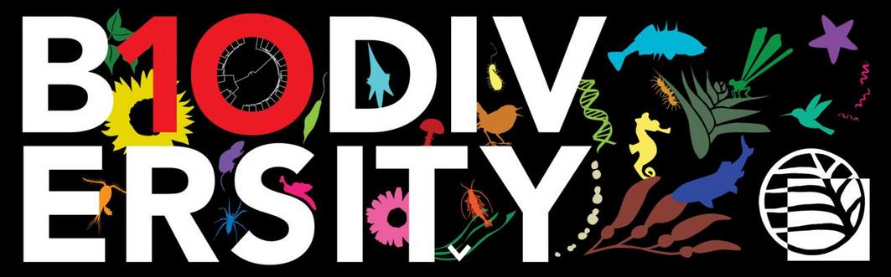

<!-- PROJECT SHIELDS -->
<!--
*** I'm using markdown "reference style" links for readability.
*** Reference links are enclosed in brackets [ ] instead of parentheses ( ).
*** See the bottom of this document for the declaration of the reference variables
*** for contributors-url, forks-url, etc. This is an optional, concise syntax you may use.
*** https://www.markdownguide.org/basic-syntax/#reference-style-links
-->
[![Contributors][contributors-shield]][contributors-url]
[![Forks][forks-shield]][forks-url]
[![Stargazers][stars-shield]][stars-url]
[![Issues][issues-shield]][issues-url]
[![License][license-shield]][license-url]
[![LinkedIn][linkedin-shield]][linkedin-url]

<!-- PROJECT LOGO -->
<br />
<div align="center">
  <a href="https://biodiversity.ubc.ca/">
    
  </a>

<h3 align="center">Beaty Biodiversity Centre Bioinformatics Resources</h3>

  <p align="center">
    A location to learn about how to use the compute resources available to students in the BRC and share code.
    <br />
    <a href="https://github.com/ubc-biodiversity-bioinformatics/General"><strong>Explore the docs »</strong></a>
    <br />
    <br />
    <a href="https://github.com/ubc-biodiversity-bioinformatics/General/issues">Report Bug</a>
  </p>
</div>


<!-- TABLE OF CONTENTS -->
<details>
  <summary>Table of Contents</summary>
  <ol>
    <li>
      <a href="#about-the-project">About The Project</a>
    </li>
    <li>
      <a href="#getting-started-on-github">Getting Started on Github</a>
      <ul>
        <li><a href="#github-desktop-download">Github Desktop Download</a></li>
        <li><a href="#setting-up-a-github-account">Setting up a Github Account</a></li>
        <li><a href="#Cloning-a-repo-to-your-computer">Cloning a repo to your computer</a></li>
      </ul>
    </li>
    <li><a href="#usage">Usage</a></li>
    <li><a href="#roadmap">Roadmap</a></li>
    <li><a href="#contributing">Contributing</a></li>
    <li><a href="#license">License</a></li>
    <li><a href="#contact">Contact</a></li>
    <li><a href="#acknowledgments">Acknowledgments</a></li>
  </ol>
</details>


<!-- ABOUT THE PROJECT -->
## About The Project

Here's a blank template to get started. We will need to:
* update the table of contents \
* fill in more details \
* add a list of useful code to share here\

<p align="right">(<a href="#readme-top">back to top</a>)</p>

<!-- HELPFUL RESOURCES -->
## Helpful resources

* https://training.westdri.ca/ \
* https://ace-net.ca/training.html \
* https://www.youtube.com/channel/UC4MnFGdOTSLjuWMwNCo5Zcg (there are recordings of a lot of the course/workshop materials) \
* https://training.westdri.ca/events/upcoming-training-winter-spring-2023/ (should be a new link for the fall schedule) \
* https://training.westdri.ca/domains/bioinfo/ (some bioinformatics specific info) \


<!-- GETTING STARTED ON GITHUB-->
## Getting Started on Github

What is Github? https://blog.hubspot.com/website/what-is-github-used-for
This is an example of how you may give instructions on setting up your project locally.
To get a local copy up and running follow these simple example steps.

### Github Desktop Download

Steps:
* Go to: https://desktop.github.com/
* Click the purple download button
* Follow the instructions to install on your machine

### Setting up a Github account

Make a Github account by following the instructions here: https://docs.github.com/en/get-started/quickstart/creating-an-account-on-github
Make a note of your username to send to XX to get added to the BRC Biodiversity Github organization. 
  
### Cloning a repo to your computer

1. Open the Github Desktop App on your computer. 

[![Product Name Screen Shot][product-screenshot]](https://desktop.github.com/)

2. Go to the top left. 
Under 'Add' select 'Clone the repository'. \

[![Product Name Screen Shot][product-screenshot2]](https://desktop.github.com/)

Under the URL tab paste the following URL: \
   ```
   https://github.com/ubc-biodiversity-bioinformatics/General.git
   ```
3. Choose the path you would like to save the code to on your computer. \
Note that this folder that you select will be tracked by git and has version control. \
Click 'Clone'. This should download the repo to your computer. \

4. Navigate to the Github folder local path on your computer.\
To try editing a file through Github Desktop, add your name to the 'Add-your-name-here.txt' text document in the 'Test' folder. 

5. Once you have edited the file on your computer, go back to the Github Desktop app. \
Under the General repo there should be a new change shown with the blue circle next to the repo name. \
The changes you made should be listed under 'Changes' whn you click on the repo name 'General'. \
Add a short summary of the change you made to 'Summary (required)' and press 'Commit'.

6. You can make your changes go live on the online Github repo by pressing 'Push origin'. 
To do this you may also need to download the most recent version of the repo with the 'Pull origin' command.


<p align="right">(<a href="#readme-top">back to top</a>)</p>

<!-- SERVER LOGINS AND GENERAL USAGE -->
## Servers

What computing resources exist for grad students and post docs in the Biodiversity Research Centre? \
What are these resources helpful for? \

How to get started using them? \
- make an account through your lab or compute canada (more information below) \
- watch introductory videos and read information below \
- upload your data or test data to the server \
- try some basic processing \

### Login on Windows
Download MobaXterm for working with the server on Windows:
https://mobaxterm.mobatek.net/download.html

### Login on a Mac or Linux
Bring up the Terminal on your computer. 
Type:

  ```
ssh <username>@servername.ubc.ca
  ```
The names of specific servers are given below.

## Software for code editing
VS Code and Notepad++

## Visualizing images/directories on the servers
https://sourceforge.net/projects/xming/
  ```
feh image.png
  ```

<!-- SPECIFIC SERVER INFO -->
##Specific server info

### Compute Canada

You can find the instructions to make your account here: 
https://alliancecan.ca/en/services/advanced-research-computing/account-management/apply-account
https://docs.alliancecan.ca/mediawiki/images/2/24/Getting_An_Account.pdf
You will need your lab's CCRI #
If your lab does not yet have a Compute Canada account, any PI can apply here: 
https://alliancecan.ca/en/services/advanced-research-computing/accessing-resources/rapid-access-service

  ```
<username>@cedar.computecanada.ca
<username>@graham.computecanada.ca
<username>@beluga.computecanada.ca
<username>@narval.computecanada.ca
  ```

To find out when the servers are down you can look at the status information: https://status.alliancecan.ca/

Best practices for using the Compute Canada servers:
Login and moving data  https://www.youtube.com/watch?v=8silMRq2iUg 
Running jobs: https://www.youtube.com/watch?v=EY-NIGhCnhQ

Technical documentation: https://docs.alliancecan.ca/wiki/Technical_documentation

More videos:
https://www.youtube.com/@WestDRI

### Globus data transfer
Accessing data on Compute Canada can be done through Globus (GUI).
Login here with your compute canada account: https://www.globus.org/data-transfer
Move files between locations under File Manager. 

### Zoology servers

Use this space to show useful examples of how a project can be used. Additional screenshots, code examples and demos work well in this space. You may also link to more resources.

_For more examples, please refer to the [Documentation](https://example.com)_

<p align="right">(<a href="#readme-top">back to top</a>)</p>

### Botany servers

Use this space to show useful examples of how a project can be used. Additional screenshots, code examples and demos work well in this space. You may also link to more resources.

_For more examples, please refer to the [Documentation](https://example.com)_

<p align="right">(<a href="#readme-top">back to top</a>)</p>

<!-- FURTURE CODE -->
## Future suggested code to add

- [ ] Feature 1
- [ ] Feature 2
- [ ] Feature 3
    - [ ] Nested Feature

See the [open issues](https://github.com/ubc-biodiversity-bioinformatics/General/issues) for a full list of proposed features (and known issues).

<p align="right">(<a href="#readme-top">back to top</a>)</p>

<!-- SPECIFIC LAB GITHUB PAGES -->
## Specific lab github pages

* [Rieseberg Lab](https://github.com/rieseberglab)
* []()
* []()


<!-- OTHER RELEVANT LINKS -->
## Other relevant links

* []()
* []()
* []()

<p align="right">(<a href="#readme-top">back to top</a>)</p>

<!-- CONTRIBUTING -->
## Contributing

Contributions are what make the open source community such an amazing place to learn, inspire, and create. Any contributions you make are **greatly appreciated**.

If you have a suggestion that would make this better, please fork the repo and create a pull request. You can also simply open an issue with the tag "enhancement".
Don't forget to give the project a star! Thanks again!

1. Clone the this repo to your Github Desktop
2. Make your changes on your computer
3. Commit your Changes (`git commit -m 'Add some AmazingFeature'`)
4. Push to the Branch (`git push origin feature/AmazingFeature`)

<p align="right">(<a href="#readme-top">back to top</a>)</p>


<!-- CONTACT -->
## Contact

If you ahve questions please contact:

Your Name - email@email_client.com

Project Link: [https://github.com/ubc-biodiversity-bioinformatics/General](https://github.com/ubc-biodiversity-bioinformatics/General)

<p align="right">(<a href="#readme-top">back to top</a>)</p>

<!-- LICENSE -->
## License

Distributed under the UBC License. See `LICENSE.txt` for more information.

<p align="right">(<a href="#readme-top">back to top</a>)</p>


<!-- ACKNOWLEDGMENTS -->
## Acknowledgments

Use this space to list resources you find helpful and would like to give credit to. I've included a few of my favorites to kick things off!

* [Choose an Open Source License](https://choosealicense.com)
* [GitHub Emoji Cheat Sheet](https://www.webpagefx.com/tools/emoji-cheat-sheet)
* [Malven's Flexbox Cheatsheet](https://flexbox.malven.co/)
* [Malven's Grid Cheatsheet](https://grid.malven.co/)
* [Img Shields](https://shields.io)
* [GitHub Pages](https://pages.github.com)
* [Font Awesome](https://fontawesome.com)
* [React Icons](https://react-icons.github.io/react-icons/search)

<p align="right">(<a href="#readme-top">back to top</a>)</p>


<!-- MARKDOWN LINKS & IMAGES -->
<!-- https://www.markdownguide.org/basic-syntax/#reference-style-links -->
[contributors-shield]: https://img.shields.io/github/contributors/ubc-biodiversity-bioinformatics/General.svg?style=for-the-badge
[contributors-url]: https://github.com/ubc-biodiversity-bioinformatics/General/graphs/contributors
[forks-shield]: https://img.shields.io/github/forks/ubc-biodiversity-bioinformatics/General.svg?style=for-the-badge
[forks-url]: https://github.com/ubc-biodiversity-bioinformatics/General/network/members
[stars-shield]: https://img.shields.io/github/stars/ubc-biodiversity-bioinformatics/General.svg?style=for-the-badge
[stars-url]: https://github.com/ubc-biodiversity-bioinformatics/General/stargazers
[issues-shield]: https://img.shields.io/github/issues/ubc-biodiversity-bioinformatics/General.svg?style=for-the-badge
[issues-url]: https://github.com/ubc-biodiversity-bioinformatics/General/issues
[license-shield]: https://img.shields.io/github/license/ubc-biodiversity-bioinformatics/General.svg?style=for-the-badge
[license-url]: https://github.com/ubc-biodiversity-bioinformatics/General/blob/master/LICENSE.txt
[linkedin-shield]: https://img.shields.io/badge/-LinkedIn-black.svg?style=for-the-badge&logo=linkedin&colorB=555
[linkedin-url]: https://linkedin.com/in/othneildrew
[product-screenshot]: images/screenshot.png
[product-screenshot2]: images/screenshot2.png
[Next.js]: https://img.shields.io/badge/next.js-000000?style=for-the-badge&logo=nextdotjs&logoColor=white
[Next-url]: https://nextjs.org/
[React.js]: https://img.shields.io/badge/React-20232A?style=for-the-badge&logo=react&logoColor=61DAFB
[React-url]: https://reactjs.org/
[Vue.js]: https://img.shields.io/badge/Vue.js-35495E?style=for-the-badge&logo=vuedotjs&logoColor=4FC08D
[Vue-url]: https://vuejs.org/
[Angular.io]: https://img.shields.io/badge/Angular-DD0031?style=for-the-badge&logo=angular&logoColor=white
[Angular-url]: https://angular.io/
[Svelte.dev]: https://img.shields.io/badge/Svelte-4A4A55?style=for-the-badge&logo=svelte&logoColor=FF3E00
[Svelte-url]: https://svelte.dev/
[Laravel.com]: https://img.shields.io/badge/Laravel-FF2D20?style=for-the-badge&logo=laravel&logoColor=white
[Laravel-url]: https://laravel.com
[Bootstrap.com]: https://img.shields.io/badge/Bootstrap-563D7C?style=for-the-badge&logo=bootstrap&logoColor=white
[Bootstrap-url]: https://getbootstrap.com
[JQuery.com]: https://img.shields.io/badge/jQuery-0769AD?style=for-the-badge&logo=jquery&logoColor=white
[JQuery-url]: https://jquery.com 